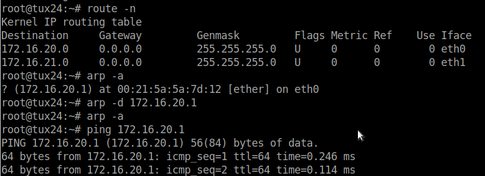

# Exp 1

## Questions

### What are the ARP packets and what are they used for?
A sigla ARP significa *Adress Resolution Protocol*. Sabendo o endereço IP da máquina com a qual estamos a tentar estabelecer comunicação, é possivel pedir o endereço MAC da mesma. 

### What are the MAC and IP addresses of ARP packets and why?

A sigla MAC significa *Medium Access Control* e a sigla IP significa *Internet Protocol*.
O endereço MAC é inerente à máquina em questão, sendo que a mesma tem um endereço único. 
Em relação ao endereço IP, o mesmo é também um idenficiador da máquina, no entanto é usado para a mesma poder comunicar no contexto de uma rede.

### What packets does the ping command generate?
### What are the MAC and IP addresses of the ping packets?
### How to determine if a receiving Ethernet frame is ARP, IP, ICMP?
### How to determine the length of a receiving frame?
### What is the loopback interface and why is it important?

## Experiment Summary

### Ligar tux23 e tux24 ao switch

### Configurar tux23 e tux24
tux 23
```bash
systemctl restart networking
ifconfig eth0 up
ifconfig eth0 172.16.20.1/24
```
tux 24
```bash
systemctl restart networking
ifconfig eth0 up
ifconfig eth0 172.16.20.254/24
```

### Usar ping para verificar conexão
Ex: tux23 para o tux24
```bash
ping 172.16.20.254/24
```

### Apagar ARP tables
```bash
route -n
arp -a
arp -d ipadress
```


### Fazer ping com o Wireshark aberto e capturar packets
Ex tux23 para o tux24:
```bash
ping 172.16.20.254/24
```

[Capturas](exp1.pcapng)