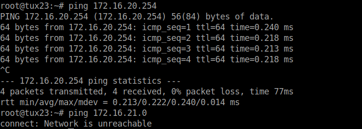

# Exp 2

## Questions

### How to configure bridgeY0?
Para configurar a bridgeY0, basta configurar devidamente o switch, criar as bridges e adicionar o tuxY3 e Y4 aos respetivos ports.

### How many broadcast domains are there? How can you conclude it from the logs?

## Experiment Summary

### Ligar tux22 ao switch
### Configurar tux22
tux 22
```bash
systemctl restart networking
ifconfig eth0 up
ifconfig eth0 172.16.21.1/24
```

### Configurar Switch 
* Connect S0 port to RS232 on the patch panel and from RS232 to the console port of the switch.
* Set the Baudrate to 115200 bps
* Login (username: admin, password: blanck)
* /system reset-configuration

### Criar Bridges
```
/interface bridge add name=bridge20
/interface bridge add name=bridge21
```

### Remover Ports da Bridge default e adicionar os tuxs aos respetivos portos nas bridges criadas
```
/interface bridge port remove [find interface=etherX]
/interface bridge port remove [find interface=etherX]
/interface bridge port remove [find interface=etherX]
/interface bridge port add bridge=bridge20 interface=etherX
/interface bridge port add bridge=bridge20 interface=etherX
/interface bridge port add bridge=bridge21 interface=etherX

```

### Começar captura no tux23
Fazer ping ao tux24
```bash
ping 172.16.20.254/24
```
Fazer ping ao tux22 (não é suposto dar)
```bash
ping 172.16.20.254/24
```



### Começar capturas no tux22, tux23, tux24
No tux23:
```bash
ping –b 172.16.21.1
```

No tux22:
```bash
ping –b 172.16.21.255
```

[Captura tux22](exp2-b-tux22.pcapng)
[Captura tux23](exp2-tux23.pcapng)
[Captura tux23](exp2-b-tux23.pcapng)
[Captura tux24](exp2-tux24.pcapng)