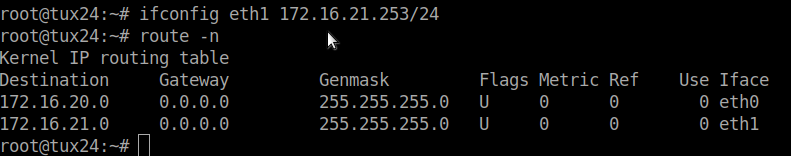
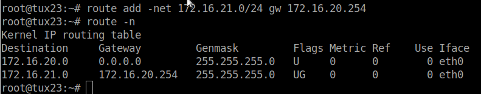
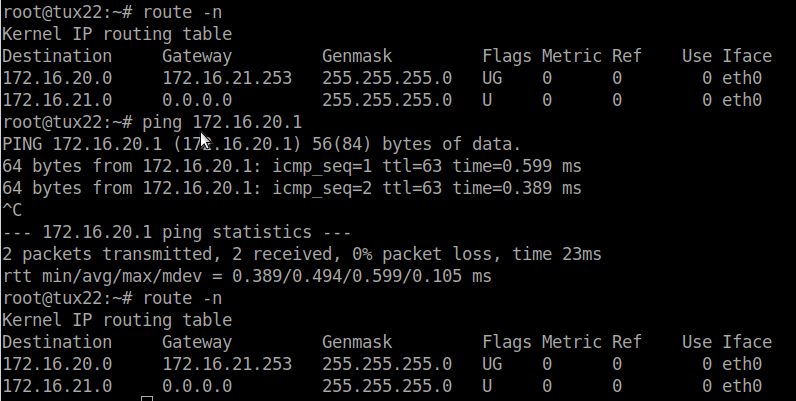

# Exp 3

## Questions

### What routes are there in the tuxes? What are their meaning?
### What information does an entry of the forwarding table contain?
### What ARP messages, and associated MAC addresses, are observed and why?
### What ICMP packets are observed and why?
### What are the IP and MAC addresses associated to ICMP packets and why?

## Experiment Summary

### Configurar eth1 para o tux24

```bash
ifconfig eth1 172.16.21.253/24
/interface bridge port add bridge=bridge21 interface=etherX
echo 1 > /proc/sys/net/ipv4/ip_forward
echo 0 > /proc/sys/net/ipv4/icmp_echo_ignore_broadcasts
ifconfig
```



### Configurar tux22 e tux23 para comunicarem



### Ver routes nos tuxs

```bash
route –n
```


### Capturar packets no tux23 e fazer ping

```bash
ping 172.16.Y0.254
ping 172.16.Y1.253
ping 172.16.Y1.1
```

[Captura](exp3.pcapng)

### Começar capturas no tux24 (2 instancias)

Limpar tabelas nos 3 tuxs
```bash
route -n
arp -a
arp -d ipadress
```

No tux23 fazer ping ao tux22
```bash
ping 172.16.21.1/24
```

[Captura eth0](exp3-eth0.pcapng)
[Captura eth1](exp3-eth1.pcapng)
