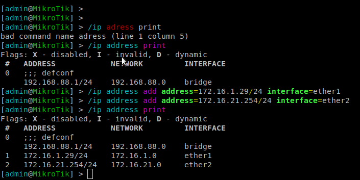

# Exp 4

## Questions

### How to configure a static route in a commercial router?
### What are the paths followed by the packets in the experiments carried out and why?
### How to configure NAT in a commercial router?
### What does NAT do?

## Experiment Summary

### Conectar router (Rc) à rede do laboratorio

No switch, adicionar ether2 router à bridge 21
```
/interface bridge port remove [find interface=etherX]
/interface bridge port add bridge=bridge21 interface=etherX
```

Conectar ether1 à labnetwork P2.1 e o ether 2 a uma porta da bridge 21

Configurar Router
* Connect S0 port to RS232 on the patch panel and from RS232 to the Router MTIK.
* Set the Baudrate to 115200 bps
* Login (username: admin, password: blanck)
* /system reset-configuration

Configurar endereço ip através da consola do router
```
/ip address add address=172.16.1.29/24 interface=ether1
/ip address add address=172.16.21.254/24 interface=ether2
/ip address print
```


### Adicionar default routes
tux24 como default router para o tux23
```bash
route add default gw 172.16.20.254
```

Rc como default router para tux22 e tux24
```bash
route add default gw 172.16.21.254
```

No tux22 e no Rc adicionar routes para 172.16.Y0.0/24
```bash
route add -net 172.16.20.0/24 gw 172.16.21.253
/ip route add dst-address=172.16.20.0/24 gateway=172.16.21.253
```

Default router Rc
```bash
/ip route add dst-address=0.0.0.0/0 gateway=172.16.1.254
```

### Verificar que tux23 consegue fazer ping a todas as network interfaces

ping tux24

ping tux22 and Rc


### No tux22

```bash
echo 0 > /proc/sys/net/ipv4/conf/eth0/accept_redirects
echo 0 > /proc/sys/net/ipv4/conf/all/accept_redirects
```

Remover rota pelo tux24 e fazer ping tux23
```bash
route del -net 172.16.20.0/24 gw 172.16.21.253
ping 172.16.20.1
traceroute 172.16.20.1
route del -add 172.16.20.0/24 gw 172.16.21.253
traceroute 172.16.20.1
```


[Captura](exp4.pcapng)

Ativar ICMP

```bash
echo 1 > /proc/sys/net/ipv4/conf/eth0/accept_redirects
echo 1 > /proc/sys/net/ipv4/conf/all/accept_redirects
```

Remover rota pelo tux24 e fazer ping tux23
```bash
route del -net 172.16.20.0/24 gw 172.16.21.253
ping 172.16.20.1
traceroute 172.16.20.1
route -add 172.16.20.0/24 gw 172.16.21.253
traceroute 172.16.20.1
```


### No tux23 ping lab router
```ping
ping 172.16.1.254
/ip firewall nat disable 0
```
Desativar NAT e fazer ping de novo
```ping
ping 172.16.1.254
```

